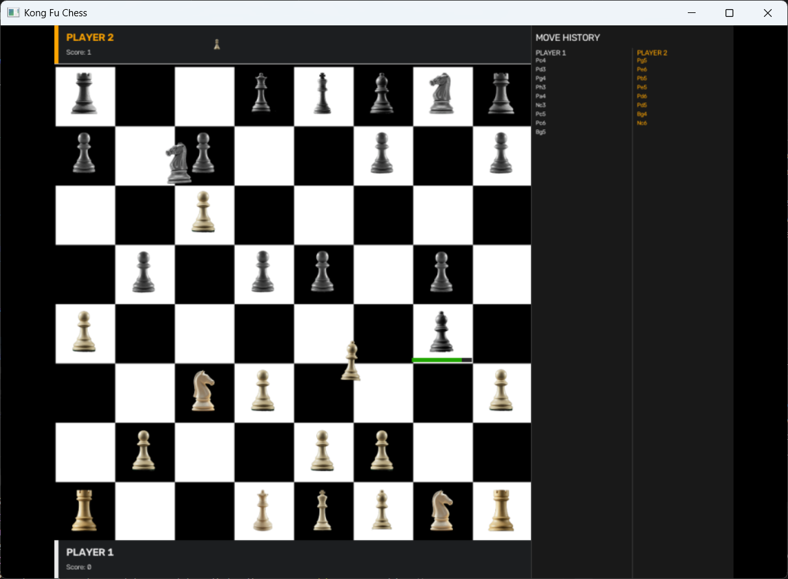

# Kong Fu Chess


> This repository is under active development. The architecture, real-time motion model, and guard rails are intentionally designed for extensibility, clarity, and deterministic concurrency handling.



## PROJECT OVERVIEW

Kong Fu Chess is a real-time, cooldown-driven variant of traditional chess in which actions are not gated by turns. Instead, pieces move continuously through the board as asynchronous motions, each constrained by timing, route safety, and arrival semantics. The game emphasizes immediate intent, non-blocking motion, and deterministic resolution when multiple trajectories overlap or complete at nearly the same instant.

### Core Gameplay Mechanics

- Pieces move in a real-time simulation rather than a turn-based exchange.
- Motion is represented as an in-flight trajectory with an explicit duration budget, allowing the system to advance the clock continuously.
- In-place jumps are supported as zero-distance motions with a fixed duration, enabling immediate, local re-positioning without a traditional move-turn cycle.
- The board resolves arrivals atomically at the exact completion instant, ensuring captures and promotions occur predictably.
- The engine enforces safety guards so that overlapping motions and shared routes do not corrupt the board state.
- Physical constants (`CELL_SIZE`, `PIECE_SPEED`) are centralized in `config.py` and drive all duration calculations.

### Design Intent

The project is structured around a clear separation of concerns:

- Input and interaction are captured independently from game rules.
- Motion timing and arrival resolution are handled by a dedicated real-time arbiter.
- Movement legality and promotion logic are implemented as pure, stateless rules.
- The domain model remains simple, grid-based, and easy to reason about.
- Game state changes (moves, captures, game-over) are broadcast through an in-process event bus rather than being computed ad hoc by consumers.
- The engine is completely unaware of presentation: it never imports `cv2`/`numpy`, and never touches raw text tokens. Two independent gateways — a text CLI and an OpenCV GUI — sit on top of the same engine and translate to/from their own I/O formats.

---

## SYSTEM ARCHITECTURE & COMPONENT BREAKDOWN

The system is organized as a clean, decoupled multi-layer architecture that mirrors the responsibilities of a production-grade real-time game engine. Two presentation gateways (text CLI, OpenCV GUI) sit on top of one shared engine core.

```
app_gateways/text_cli/          Text CLI gateway (stdin/stdout I/O boundary)
app_gateways/gui/                OpenCV GUI gateway (pixels/mouse I/O boundary)
chess_engine/engine/             Application service orchestration + event bus
chess_engine/engine/helpers/     Snapshot DTOs, move history, score tracking
chess_engine/input/              Interaction and board-coordinate mapping
chess_engine/model/              Domain objects: board, piece, position
chess_engine/realtime/           Motion tracking and atomic arrival resolution
chess_engine/rules/              Stateless movement and promotion rules
chess_engine/tests/              Engine unit and integration coverage
config.py                        Global physical constants
main.py                          Entry point (`--gui` flag selects gateway)
run_gui.py                       Standalone GUI entry point (double-click / frozen build)
```

---

### 1. CLI Gateway — `app_gateways/text_cli/`

The sole boundary between raw text tokens and the typed engine. Nothing outside this package ever handles raw string tokens.

| Module | Responsibility |
|---|---|
| [translator.py](app_gateways/text_cli/translator.py) | Converts token strings ↔ typed `Piece` objects; parses and serializes `Board` |
| [bootstrap.py](app_gateways/text_cli/bootstrap.py) | Factory that wires the full engine stack into a `GameRuntime` dataclass |
| [console_runner.py](app_gateways/text_cli/console_runner.py) | Reads `board:` / `commands:` sections from stdin and dispatches commands |
| [command_registry.py](app_gateways/text_cli/command_registry.py) | O(1) dispatch table mapping command names (`click`, `wait`, `jump`, `print`) to handler functions |

**Token format:** `wK`, `bQ`, `wR`, `bP`, etc. — color prefix + piece-type letter. Empty cells are `.`.

**Bootstrap wiring order:**
1. `Board` is created (or injected).
2. `RuleEngine` is instantiated.
3. `RealTimeArbiter` is created with the board (game engine reference set later).
4. `GameEngine` is created with board, rule engine, and arbiter.
5. `arbiter.attach_game_engine(engine)` closes the circular reference.
6. `BoardMapper` and `Controller` are created and wrapped in `GameRuntime`.

`app_gateways/gui/bootstrap.py` performs the identical wiring sequence (same six steps) against a different default board and a `GuiRunner` instead of a `ConsoleRunner` — see [Known Issues](#known-issues--audit-findings) for the case for extracting this into one shared helper.

---

### 2. Application Service Layer — `chess_engine/engine/`

The engine orchestrates all gameplay flow between input, rules, and motion handling, and publishes domain events for anything downstream (move history, score tracking, GUI feedback) instead of computing that bookkeeping itself.

| Module | Responsibility |
|---|---|
| [game_engine.py](chess_engine/engine/game_engine.py) | Validates and dispatches moves; owns game-over state; publishes events |
| [event_manager.py](chess_engine/engine/event_manager.py) | In-process, synchronous pub/sub bus (`subscribe(type, handler)` / `publish(event)`) |
| [events.py](chess_engine/engine/events.py) | Event DTOs: `MoveAccepted`, `PieceCaptured`, `GameOver` |
| [helpers/move_history.py](chess_engine/engine/helpers/move_history.py) | Subscribes to `MoveAccepted`; builds algebraic-ish move feed (`Nxe5`) |
| [helpers/score_manager.py](chess_engine/engine/helpers/score_manager.py) | Subscribes to `PieceCaptured`; accumulates material score + captured-piece list per color |
| [helpers/piece_info.py](chess_engine/engine/helpers/piece_info.py) | `PieceInfo` — frozen `(piece_type, color)` DTO used at the engine→GUI boundary |
| [helpers/snapshot_models.py](chess_engine/engine/helpers/snapshot_models.py) | Frozen DTOs: `MoveResult`, `GameSnapshot` |
| [helpers/snapshot_helpers.py](chess_engine/engine/helpers/snapshot_helpers.py) | Pure builder functions for read-only board snapshots |

**`GameEngine` public API:**

- `request_move(source, destination) → MoveResult` — full guard chain + arbiter dispatch; publishes `MoveAccepted` on success
- `request_jump(position) → MoveResult` — in-place cooldown jump; publishes `MoveAccepted` on success
- `wait(ms)` / `advance_time(ms)` — delegates clock ticks to the arbiter; drains arbiter captures and publishes `PieceCaptured` for each
- `get_snapshot(selected_cell) → GameSnapshot` — read-only board view
- `notify_king_captured()` — sets the game-over flag and publishes `GameOver` (called by the arbiter on king capture)
- `history_entries()` / `get_scores()` / `get_captured(color)` — read accessors backed by the event-driven helpers above

**Guard chain in `request_move` / `request_jump`:**
1. Game-over check → `game_over`
2. Cooldown check via `arbiter.is_in_cooldown(source)` → `cooldown_active`
3. In-flight check via `_is_piece_in_flight(arbiter, source)` → `motion_in_progress`
4. Rule validation via `RuleEngine.validate_move` → propagated reason string
5. Destination-claim check via `arbiter.is_destination_claimed(...)` → `destination_claimed` (guards against two friendly pieces racing to the same empty square; `request_move` only)
6. `arbiter.start_motion(...)` on success → `ok`

**`IRealTimeArbiter` protocol** is defined in `game_engine.py`, keeping the engine decoupled from the concrete arbiter implementation.

`GameEngine` constructs its own `EventManager`, `MoveHistory`, and `ScoreManager` in `__init__`; an external `EventManager` can be injected (mainly for tests).

---

### 3. Input Layer — `chess_engine/input/`

Translates raw pixel events into semantic game operations. This layer is intentionally thin and does not evaluate board rules or timing.

| Module | Responsibility |
|---|---|
| [controller.py](chess_engine/input/controller.py) | Two-click selection state machine; forwards validated intents to the engine |
| [board_mapper.py](chess_engine/input/board_mapper.py) | Converts pixel coordinates to `Position` using `CELL_SIZE` from `config.py` |

**Controller click semantics:**
- First click on a piece → sets `selected_cell`.
- Second click outside board → clears selection.
- Second click on a friendly piece → swaps selection to that piece (no move request).
- Second click on any other cell → calls `engine.request_move(source, destination)` and clears selection.
- Clicking the same cell twice → calls `engine.request_jump(position)` (the GUI's only path to a jump; the text CLI's standalone `jump` command reaches the engine directly instead — see [Known Issues](#known-issues--audit-findings)).

---

### 4. Real-Time Layer — `chess_engine/realtime/`

The real-time arbiter is the heart of the simulation. It is the only layer that mutates the board during active motion.

| Module | Responsibility |
|---|---|
| [arbiter.py](chess_engine/realtime/arbiter.py) | Clock-driven motion manager; resolves arrivals atomically |
| [motion.py](chess_engine/realtime/motion.py) | Mutable dataclass tracking a single in-flight piece movement |

#### `Motion` dataclass

```python
@dataclass(eq=False)
class Motion:
    piece: Piece
    source: Position
    destination: Position
    elapsed_ms: int = 0
    duration_ms: int = 0
```

Identity is by object reference (`eq=False`), not by field values, so two motions to the same cell are always distinct.

#### `RealTimeArbiter` internals

| Field | Type | Purpose |
|---|---|---|
| `_active_motions` | `list[Motion]` | All currently in-flight motions |
| `_motion_pieces` | `dict[Motion, Piece]` | Tracks the shadow `MOVING` piece per motion for state reset on arrival |
| `_cooldowns` | `dict[Position, int]` | Remaining cooldown ms per cell |

**Duration calculation:** `steps × CELL_SIZE / PIECE_SPEED × 1000 ms`, where `steps = max(Δrow, Δcol)`.

**`advance_time(ms)` sequence:**
1. Tick down all cooldown counters; drop expired entries.
2. Increment `elapsed_ms` on every active motion.
3. Run `_resolve_mid_route_collisions()`.
4. Collect completed motions (elapsed ≥ duration); sort by `(priority, index)` — linear arrivals (`priority=0`) before jump arrivals (`priority=1`).
5. Call `_resolve_arrival(motion)` for each completed motion in order.

**`is_in_cooldown(pos)` — piece-state-aware lookup:**
```python
def is_in_cooldown(self, pos: Position) -> bool:
    if pos not in self._cooldowns:
        return False
    piece = self._board.get(pos)
    return piece is not None and piece.state != PieceState.MOVING
```
Intent: a cooldown is only active when a piece is physically present on the cell **and** that piece is not currently `MOVING`. In the current implementation the `piece.state != PieceState.MOVING` half of this check is effectively always `True` — see [Known Issues](#known-issues--audit-findings) (`MOVING` is only ever set on a disconnected shadow copy, never on the board-resident `Piece`) — so the expression currently reduces to `piece is not None`.

**`_resolve_arrival(motion)` — atomic transition:**
1. Clear source cell.
2. Check destination for a king → call `game_engine.notify_king_captured()` if found.
3. Apply pawn promotion via `_promoted(piece, row, board.rows)`.
4. Place final piece at destination.
5. Set `_cooldowns[destination] = 1000 ms`.
6. Reset shadow piece state to `IDLE`.

**`_cancel_motion(motion, land_at)` — mid-route stop:**
- Removes motion from active list.
- Places piece at `land_at` (last safe cell before collision).
- Sets cooldown on `land_at`.
- Resets shadow piece state to `IDLE`.

---

### 5. Rules Layer — `chess_engine/rules/`

Deliberately stateless and pure. No board mutation occurs here.

| Module | Responsibility |
|---|---|
| [engine.py](chess_engine/rules/engine.py) | `RuleEngine` — iterates the guard pipeline and returns `MoveValidation` |
| [movement.py](chess_engine/rules/movement.py) | Legal destination computation per piece type via a functional registry |
| [trajectory.py](chess_engine/rules/trajectory.py) | Linear path generation and route-overlap detection |
| [guards/boundary_guard.py](chess_engine/rules/guards/boundary_guard.py) | Rejects out-of-bounds source or destination |
| [guards/empty_source_guard.py](chess_engine/rules/guards/empty_source_guard.py) | Rejects moves from empty cells |
| [guards/friendly_fire_guard.py](chess_engine/rules/guards/friendly_fire_guard.py) | Rejects moves onto friendly-occupied cells |
| [guards/legal_move_guard.py](chess_engine/rules/guards/legal_move_guard.py) | Rejects destinations outside the piece's legal movement set |

#### Guard Pipeline

`RuleEngine.validate_move` iterates `_GUARDS` in order and returns the first failing reason:

```
boundary_guard → empty_source_guard → friendly_fire_guard → legal_move_guard
```

Each guard module exposes a single `check(board, source, destination) → str | None` function. Returning `None` means the guard passes. Because `empty_source_guard` always runs before `legal_move_guard`, the latter's own `empty_source` branch is unreachable through this pipeline (see [Known Issues](#known-issues--audit-findings)).

#### Movement Registry

`movement.py` uses a `_REGISTRY: dict[PieceType, RuleFn]` for O(1) dispatch:

| Piece | Strategy |
|---|---|
| ROOK | `_slide` along 4 cardinal directions |
| BISHOP | `_slide` along 4 diagonal directions |
| QUEEN | `_slide` along all 8 directions |
| KNIGHT | Fixed L-shape offsets, no sliding |
| KING | All 8 adjacent cells, one step |
| PAWN | Forward step, optional double step from start row, diagonal captures only |

`legal_destinations(board, from_pos, piece)` is the single public entry point.

#### Trajectory Module

- `linear_path(source, destination) → list[Position]` — generates the ordered list of cells along a straight or diagonal line. Used by the arbiter's mid-route collision resolution.
- `has_route_conflict(src_a, dst_a, src_b, dst_b) → bool` — returns `True` if two linear paths share any cell. Fully unit-tested but currently not called from any production path — `RealTimeArbiter._resolve_mid_route_collisions` implements its own cell-by-cell check instead (see [Known Issues](#known-issues--audit-findings)).

---

### 6. Domain Model — `chess_engine/model/`

Minimal, explicit, and string-blind throughout.

| Module | Key types |
|---|---|
| [position.py](chess_engine/model/position.py) | `Position(row, col)` — frozen dataclass, hashable, immutable |
| [piece.py](chess_engine/model/piece.py) | `Piece(piece_type, color)`, `PieceType` enum, `Color` enum, `PieceState` enum |
| [board.py](chess_engine/model/board.py) | `Board(rows, cols)` — matrix of `Piece \| None`; raises on out-of-bounds access |

**`PieceState` enum:**

| Value | Meaning |
|---|---|
| `IDLE` | Piece is at rest on the board |
| `MOVING` | Intended to mark an in-flight piece; in practice only ever set on a disconnected shadow copy the arbiter tracks internally, never on the `Piece` instance actually stored on the board (see [Known Issues](#known-issues--audit-findings)) |
| `CAPTURED` | Assigned to a piece the instant it's captured, after it has already been removed from the board — nothing currently reads this value back |

`Piece.__eq__` and `__hash__` are based on `(piece_type, color)` only — state is mutable and excluded from identity.

---

## GUI GATEWAY — `app_gateways/gui/`

OpenCV/numpy-based renderer, layered on top of the same `GameRuntime` the text CLI bootstraps (`bootstrap.py` builds one via `app_gateways.text_cli.bootstrap.GameRuntime`, then wraps it in `GuiRunner`). The engine remains completely unaware of OpenCV/pixels; `renderer.py` and `translator.py` were audited and confirmed to import nothing from `chess_engine.engine`/`realtime`/`input` — only frozen DTOs and model types.

| Module | Responsibility |
|---|---|
| [gui_runner.py](app_gateways/gui/gui_runner.py) | Main loop: `advance_time` → pull snapshot/motions/cooldowns → sync animators → render → handle input |
| [renderer.py](app_gateways/gui/renderer.py) | Pure drawing given a snapshot + animator states; no engine calls |
| [translator.py](app_gateways/gui/translator.py) | GUI-side board/asset helpers (`standard_board()`, `piece_dir()`) |
| [img.py](app_gateways/gui/img.py) | Thin OpenCV wrapper: load/scale/composite/text-overlay for sprite frames and canvases |
| [bootstrap.py](app_gateways/gui/bootstrap.py) | Wires a `GameRuntime` (starting from `standard_board()`) into a `GuiRunner` |
| [animation/anim_state.py](app_gateways/gui/animation/anim_state.py) | `AnimState` enum + legal transition table |
| [animation/piece_animator.py](app_gateways/gui/animation/piece_animator.py) | Per-piece sprite-sheet playback state machine |
| [animation/sprite_sheet.py](app_gateways/gui/animation/sprite_sheet.py) | Loads a state's frames + timing from its `config.json` |

**Animation state machine:** `IDLE → MOVE|JUMP → LONG_REST|SHORT_REST → IDLE`. `MOVE`/`JUMP` correspond to an active `Motion`; `LONG_REST` follows a linear move, `SHORT_REST` follows a jump; both rest states auto-transition back to `IDLE` when their (non-looping) sprite sheet finishes.

**Coordinate handling:** the canvas is letterboxed to fit an arbitrarily resized window while staying aspect-correct. Mouse clicks are translated from window space to native canvas space (`letterbox_transform` / `window_to_native`) before being forwarded to `runtime.controller.click(x, y)`.

**`GuiRunner._sync_animators`** reconciles animator objects (keyed by board cell) against the current list of active `Motion`s and the board every frame — including relocating an animator from source to destination when a motion completes, rebuilding it if a pawn promoted on arrival, and dropping it if the piece was captured mid-route instead of arriving. Rebuilding an animator re-reads all five state sprite sheets from disk synchronously; see [Known Issues](#known-issues--audit-findings) for the promotion-time hitch this causes.

**Rest-animation timing is independent of the engine's cooldown clock.** The arbiter's cooldown is a fixed 1000 ms; `LONG_REST`/`SHORT_REST` playback length is instead whatever each piece's `config.json` specifies (hand-tuned, not derived from the engine constant). The two are not linked by any shared source of truth — see [Known Issues](#known-issues--audit-findings).

### Working across the engine/GUI boundary

When adding a new piece of engine state that the GUI needs to display, prefer exposing it as a new event + helper (as done for score/history) or a new field on `GameSnapshot`/a frozen DTO like `PieceInfo`/`CapturedEntry`, rather than handing the GUI a live `Piece`/`Board` reference — the existing code deliberately keeps mutable domain objects on the engine side of the boundary. `GuiRunner._sync_animators` is the one place today that reaches through this boundary directly (it holds `self._runtime.board`, a live `Board`) rather than consuming a snapshot; see [Known Issues](#known-issues--audit-findings).

---

## DESIGN PATTERNS IMPLEMENTED

### Event-Driven State Propagation

`GameEngine` does not compute score or move history itself. It publishes `MoveAccepted`, `PieceCaptured`, and `GameOver` through an in-process `EventManager`, and `MoveHistory`/`ScoreManager` subscribe independently. This keeps the orchestration method (`request_move`, `advance_time`, `notify_king_captured`) focused on validation and dispatch, with bookkeeping fully decoupled and independently testable.

### Functional Registry Pattern

Both movement dispatch and guard sequencing replace large decision trees with compact, constant-time registries.

- `movement.py` uses `_REGISTRY: dict[PieceType, RuleFn]` for O(1) piece-type dispatch.
- `engine.py` uses `_GUARDS: list[module]` for ordered, short-circuit guard evaluation.
- `command_registry.py` uses a `dict[str, CommandFn]` for O(1) CLI command dispatch.

### Real-Time Cooldown / Motion Queue State Machine

Each motion transitions through three logical states:

```
pending → in-flight (elapsed < duration) → resolved (elapsed ≥ duration)
```

The arbiter advances the simulation clock and evaluates completion thresholds on every `advance_time` call. Cooldowns are a separate time-keyed dict that decays independently of active motions.

### Atomic Arrival & Concurrency Resolution

Arrival handling is a single consistent transition:

1. Clear source.
2. Check for king capture.
3. Apply promotion.
4. Place piece at destination.
5. Set cooldown.

Linear arrivals are resolved before jump arrivals in the same tick, preventing race-like ordering artifacts.

### Protocol-Based Dependency Inversion

`GameEngine` depends on `IRealTimeArbiter` (a `Protocol`) rather than the concrete `RealTimeArbiter`. `Controller` depends on `IGameEngine` (a `Protocol`). This keeps each layer independently testable and substitutable. (The protocol signatures have drifted from their concrete implementations in a couple of spots — see [Known Issues](#known-issues--audit-findings).)

### Immutable DTOs

`MoveResult`, `GameSnapshot`, and `PieceInfo` are `@dataclass(frozen=True)`. `Position` is a `@dataclass(frozen=True)`. `MoveValidation` in `rules/engine.py` is also frozen. No mutable state leaks across layer boundaries through these objects.

---

## CONCURRENCY & ROUTING GUARDS

### Same-Piece Lockout

If a source cell already has an active motion (`_is_piece_in_flight`), the request is rejected with `motion_in_progress`. This prevents double-queuing a single piece.

### Destination Claim Lockout

`request_move`/`request_jump` reject with `destination_claimed` when another in-flight friendly motion already targets the same empty square (`arbiter.is_destination_claimed`), preventing two friendly pieces from racing to the same cell.

### Cooldown Lockout

After a piece arrives or is cancelled, its destination cell enters a 1000 ms cooldown. `is_in_cooldown` blocks new move requests from that cell until the cooldown expires (subject to the `MOVING`-state caveat noted above).

### Shared Linear Route Collision

In-place jumps (`source == destination`) are non-linear and never participate in route-conflict checks.

### Mid-Route Collision Resolution

`_resolve_mid_route_collisions` runs on every `advance_time` tick:

- Computes the current interpolated cell for each active motion via `_current_cell`.
- When two motions occupy the same cell:
  - **Enemy pieces:** the later-arriving motion is cancelled to the collision cell; if the earlier is a stationary jump, the linear motion is cancelled instead.
  - **Friendly pieces:** the later motion is cancelled to its last legal stop before the collision cell, computed by `_last_legal_stop_before`.
- Jump motions are always treated as "earlier" than linear motions at the same cell.
- When `_last_legal_stop_before` finds no legal intermediate stop, the cancelled piece lands back on its own source cell — but still receives a fresh 1000 ms cooldown as though it had moved (see [Known Issues](#known-issues--audit-findings)).

---

## KNOWN ISSUES / AUDIT FINDINGS

A full read-through of every module (excluding `venv/`) turned up the following. None of these block normal play; they're listed here so they aren't rediscovered from scratch and so behavior that looks surprising in the code has an on-record explanation.

### Bugs

1. **`MOVING` piece state is never set on the board-resident `Piece`.** `RealTimeArbiter.start_motion` (`chess_engine/realtime/arbiter.py`) sets `PieceState.MOVING` only on a disconnected shadow copy kept in `_motion_pieces`; the real `Piece` sitting in the `Board` grid is never mutated until arrival. As a result, `is_in_cooldown`'s `piece.state != PieceState.MOVING` half of its check is always `True` when a piece is present, so the check silently degenerates to `piece is not None`. A downstream symptom lives in `app_gateways/gui/gui_runner.py`'s `_sync_animators`, where a "stale MOVE/JUMP" safety-net branch checks `piece.state == PieceState.IDLE` and can never see anything else.
2. **Mid-route cancellation charges a cooldown even when the piece never moved.** `RealTimeArbiter._cancel_motion` unconditionally sets a cooldown on `land_at`, but when `_last_legal_stop_before` returns the piece's own source cell (no legal intermediate stop), the piece is still cooldown-locked for 1000 ms despite having visibly stood still. `_resolve_arrival` already guards the analogous case with `if land_at != motion.source`; `_cancel_motion` should do the same.
3. **`notify_king_captured` publishes `GameOver` on every call, not just the first.** There's no `if not self._game_over` guard, so if both kings are captured in the same tick (or the callback otherwise fires twice), subscribers reacting imperatively (sound, screen transition, log) fire more than once for what should be a single event.
4. **Two `Protocol` definitions have drifted from their concrete implementations.** `IRealTimeArbiter.start_motion` in `game_engine.py` is typed `piece: str` (should be `Piece`) and omits the `duration_ms` kwarg that `request_jump` actually passes. `IGameEngine.request_move`/`request_jump` in `controller.py` are typed `-> None` but the real methods return `MoveResult`. A type checker run against either Protocol would miss real mismatches.
5. **Uncaught crash on malformed CLI command lines.** `command_registry.py`'s `_click`/`_wait` do `int(args[0])`/`int(args[1])` with no length or type validation, so a malformed `commands:` line (e.g. `click 5` or `wait abc`) raises an unhandled `IndexError`/`ValueError` that crashes the whole process, unlike the graceful `ERROR ROW_WIDTH_MISMATCH`/`ERROR UNKNOWN_TOKEN` handling used for malformed board sections.
6. **`console_runner.py` classifies board-parse errors by substring match** (`"mismatch" in str(exc)`) rather than by exception type, which is fragile to future wording changes and untested.
7. **The CLI's `jump` command bypasses `Controller` entirely** and discards the `MoveResult` it gets back, so a script author sees no feedback when a `jump` is rejected (e.g. `empty_source`, `cooldown_active`) — unlike the GUI's double-click-to-jump, which goes through the same validated path as a move.
8. **GUI: no exception safety around the OpenCV window.** `GuiRunner.run()` has no `try/finally`, so any exception mid-loop (a missing sprite asset, or `cv2.resize` on a degenerate size after shrinking the window to ~1px) leaves the native window open with no cleanup path.
9. **GUI: rest-animation length isn't tied to the engine's cooldown.** The arbiter's cooldown is a fixed 1000 ms; `LONG_REST`/`SHORT_REST` sprite playback length comes from hand-tuned `config.json` timing with no shared constant, so a piece can visually still look like it's resting after it's already legally movable again (or vice versa).
10. **GUI: per-frame disk I/O for captured-piece icons.** `Renderer._load_piece_icon` re-reads and re-decodes a PNG from disk every frame for every piece in the captured-pieces bar, with no cache.
11. **GUI: promoting a pawn mid-game triggers a synchronous full sprite reload.** `_sync_animators` constructs a new `PieceAnimator` (which eagerly loads all five state sheets from disk) the instant a promotion is detected — a likely frame hitch at the most visually important moment.
12. **`Img.draw_on` mutates the source sprite's own buffer in place** when compositing images with mismatched channel counts, rather than operating on a copy — currently harmless because sprites and canvas already agree on channel count, but a latent bug if that ever changes.

### Dead code

- `RealTimeArbiter.game_engine` property getter (`chess_engine/realtime/arbiter.py`) — only the setter is ever used.
- `has_route_conflict` (`chess_engine/rules/trajectory.py`) — fully tested, never called from production code (the arbiter reimplements collision detection independently).
- `PieceState.CAPTURED` — assigned once, never read anywhere.
- The `empty_source` branch in `legal_move_guard.check` — unreachable because `empty_source_guard` always runs first in the guard pipeline.
- `is_valid_token` (`app_gateways/text_cli/translator.py`) — callers inline the same check instead of using it.
- `ConsoleRunner.arbiter` property (`app_gateways/text_cli/console_runner.py`) — never read.
- `GameEngine.snapshot()` — a pure alias of `get_snapshot()`; the two names are used inconsistently across callers/tests.
- GUI: `PieceAnimator.rest_progress`, `translator.board_to_grid`, `Img.show()`, `Img`'s `keep_aspect=True` branch, and the unused `AnimState` import in `renderer.py`.

### Architecture notes

- `app_gateways/text_cli/bootstrap.py` and `app_gateways/gui/bootstrap.py` duplicate the same six-step wiring sequence; a shared `wire_game_runtime(board) -> GameRuntime` would remove the duplication.
- The arbiter→engine king-capture callback (`attach_game_engine`) is the only push-based coupling between `RealTimeArbiter` and `GameEngine`; captures already flow the other way via pull (`take_captures()`). Representing king-capture the same way would remove the two-phase-construction dance in every bootstrap.
- Move-rejection reason strings (`"cooldown_active"`, `"empty_source"`, `"friendly_destination"`, ...) are hand-duplicated as literals across `game_engine.py`, each guard module, and `controller.py`, with no shared enum/constants module to keep them in sync.
- `RealTimeArbiter._resolve_mid_route_collisions` is a single ~45-line method covering four distinct collision cases; it's the most complex logic in the engine and would benefit from being split into named helpers.
- `GuiRunner._sync_animators` reaches through the engine/GUI boundary via a live `Board` reference rather than a snapshot — the one place in the GUI that doesn't follow the pattern described above.
- `_COOLDOWN_MS = 1000` is duplicated as a private constant in both `arbiter.py` and `renderer.py` instead of living in `config.py` alongside `CELL_SIZE`/`PIECE_SPEED`.
- `run_gui.py`'s `sys.path` setup resolves paths relative to the script file, which works when double-clicked as a loose `.py` file but hasn't been verified against a PyInstaller `--onefile` build (no `sys._MEIPASS`/`sys.frozen` handling); its blanket `except Exception: input("Press Enter to close...")` will also hang forever if ever launched non-interactively.

---

## VERIFICATION & TESTING

```bash
./venv/Scripts/python.exe -m pytest -q
./venv/Scripts/python.exe -m pytest chess_engine/tests/ app_gateways/text_cli/tests/ app_gateways/gui/tests/ -v
```

### Test Modules

| File | Coverage area |
|---|---|
| `chess_engine/tests/test_model.py` | `Position`, `Piece`, `PieceType`, `Color`, `PieceState`, `Board` |
| `chess_engine/tests/test_piece_rules.py` | Legal destinations for all six piece types |
| `chess_engine/tests/test_promotion_rules.py` | Pawn promotion at back rank for both colors and all board sizes |
| `chess_engine/tests/test_rule_engine.py` | Full guard pipeline: boundary, empty source, friendly fire, illegal move |
| `chess_engine/tests/test_board_mapper.py` | Pixel-to-cell mapping, boundary acceptance, out-of-bounds rejection |
| `chess_engine/tests/test_controller.py` | Two-click state machine, selection swap, request_move forwarding |
| `chess_engine/tests/test_game_engine.py` | Guard chain, game-over flag, snapshot, king-capture notification |
| `chess_engine/tests/test_cooldown.py` | Cooldown lifecycle, expiry, engine-level cooldown rejection |
| `chess_engine/tests/test_real_time_arbiter.py` | Motion tracking, atomic arrival, king capture, jump vs linear ordering |
| `chess_engine/tests/test_collisions.py` | Linear path, route conflict, mid-route enemy/friendly collision, arrival ordering |
| `chess_engine/tests/test_event_manager.py` | Pub/sub subscribe/publish semantics of `EventManager` |
| `chess_engine/tests/test_move_history.py` | `MoveAccepted` → `MoveHistory` notation building |
| `chess_engine/tests/test_score_manager.py` | `PieceCaptured` → `ScoreManager` score/capture accumulation |
| `app_gateways/text_cli/tests/test_text_scripts.py` | End-to-end CLI script execution against expected output snapshots |
| `app_gateways/gui/tests/test_letterbox_mapping.py` | Window↔native canvas coordinate transform |
| `app_gateways/gui/tests/test_piece_animator.py` | Animation state machine transitions, loop vs non-loop playback |
| `app_gateways/gui/tests/test_img.py` | `Img` load/scale/composite helpers |
| `app_gateways/gui/tests/test_gui_runner_sync.py` | `_sync_animators` reconciliation against motions/board |

Current count: **262 tests, all passing** (run via `./venv/Scripts/python.exe -m pytest -q`).

---

## QUICK START

Run everything through the venv's Python — `opencv-python`/`numpy` are only installed there:

```bash
./venv/Scripts/python.exe main.py            # text CLI, reads board/commands from stdin
./venv/Scripts/python.exe main.py --gui      # OpenCV GUI, standard starting position
./venv/Scripts/python.exe run_gui.py         # GUI entry point used when double-clicked/frozen
```

Text CLI input is read from stdin in the following format:

```
board:
wR . . . bR
. . . . .
. . wK . .
. . . . .
bK . . . .

commands:
click 0 0
wait 500
print board
```

Available commands: `click <row> <col>`, `wait <ms>`, `jump <row> <col>`, `print board`.

---

## SUMMARY

Kong Fu Chess combines:

- a decoupled multi-layer architecture with strict string-blindness in the engine, shared by two independent presentation gateways (text CLI and OpenCV GUI),
- event-driven state propagation (`MoveAccepted` / `PieceCaptured` / `GameOver`) that keeps score and history bookkeeping fully decoupled from move orchestration,
- pure stateless rules with a functional registry and SRP guard pipeline,
- deterministic motion arbitration with atomic arrival and piece-state-aware cooldown,
- protocol-based dependency inversion for testability,
- explicit safety guards for concurrency, routing, and multi-piece coordination,
- and an [audited, on-record list](#known-issues--audit-findings) of dead code and known bugs so the codebase's rough edges are documented rather than silently accumulating.
