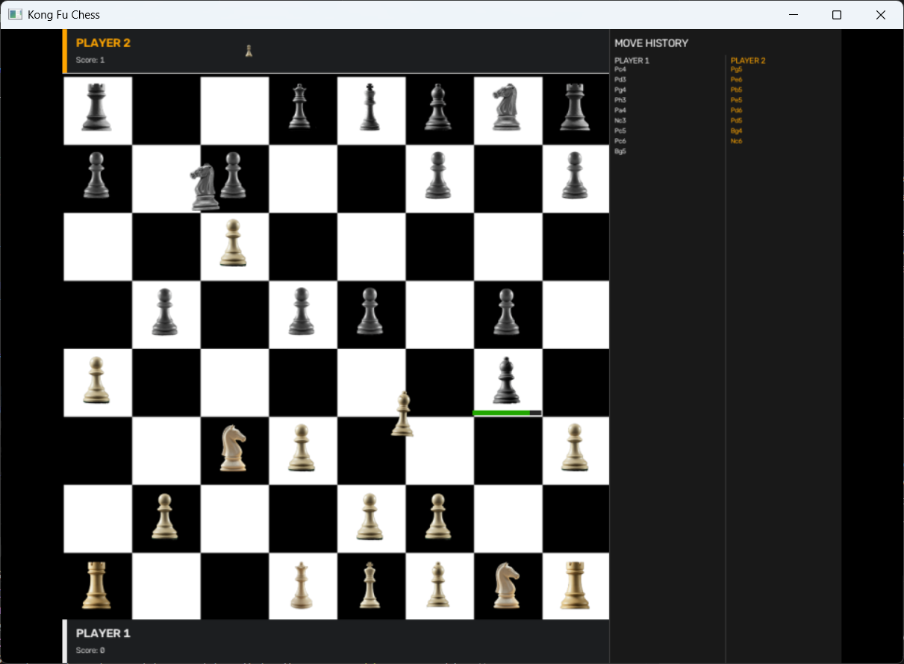

# Kong Fu Chess




## 📋 Table of Contents

- [About the Project](#about-the-project)
- [Architecture](#architecture)
- [Prerequisites](#prerequisites)
- [Installation](#installation)
- [Usage](#usage)
- [Technologies](#technologies)
- [Contributing](#contributing)
- [License](#license)

---

## About the Project

Kong Fu Chess is a real-time twist on traditional chess. There are no turns — pieces move continuously as in-flight motions, each with its own travel time based on distance and speed, so both players can act at once instead of waiting on each other. A piece takes a moment to cross the board and briefly cools down after landing, and the engine resolves collisions deterministically whenever two pieces' paths or timing overlap, so the outcome never depends on network jitter or lucky timing.

That rules/timing core is intentionally dumb about presentation — it never touches pixels, text, or a socket. Everything that makes this feel like a real game sits on top of it, in two places this project puts real weight behind:

The **multiplayer server** (`server/`) is a single asyncio process built on raw WebSockets — no HTTP framework, just one small JSON wire protocol. It handles real accounts (SQLite, password-hashed), Elo-ranged matchmaking, and ad-hoc **custom rooms**: create one under your own alias or a generated code, hand it to a friend, and up to two players plus any number of read-only spectators can join. Drop a connection mid-game and a grace period gives you a chance to reconnect before the match auto-resolves.

The **OpenCV graphical client** (`app_gateways/gui/`) is the window everyone actually plays through — animated sprite sheets per piece and per state, live cooldown bars, move history, and a lobby with modal dialogs for matchmaking and custom rooms — all driven by the same engine locally or over the network without a single line of duplicated game logic.

**Server highlights:**

- 🚪 **Custom rooms, your way** — create a room with a generated short code or your own custom alias; join by typing it in.
- 👻 **True spectator mode** — a third+ joiner becomes a read-only viewer, with the UI itself refusing every click and hover, not just the server rejecting moves after the fact.
- ⏸️ **Freeze & wait-state sync** — a solo-created room pauses the clock and cooldowns until an opponent joins, and every client's UI stays perfectly in sync with that frozen/live state.
- 📝 **Structured logging everywhere** — connections, room activity, and wire traffic are all logged with proper levels on both the server and the client, not scattered `print()` calls.

**GUI highlights:**

- 🎞️ **Full sprite animation** — per-piece, per-state sheets driving idle, move, jump, and rest playback.
- ⏳ **Live cooldown visualization** — a shrinking bar right on the board tells you exactly when a piece can act again.
- 📜 **Move history & score panel** — a running, algebraic-ish feed of every move alongside material score for both sides.
- 🧭 **Lobby modal dialogs** — Play-to-matchmake or open a Create/Join dialog for a custom room, all inside the same window that carries straight into the match.

---

## Architecture

```
chess_engine/          Core rules, board model, real-time motion arbiter — no I/O, no cv2, no network
app_gateways/
  ├─ text_cli/          stdin/stdout gateway
  └─ gui/                OpenCV graphical gateway — local play AND the networked client's front end
       ├─ renderer.py     Board, cooldown bars, move-history/score panel — pure drawing, no engine calls
       ├─ animation/       Per-piece sprite-sheet playback state machine
       ├─ lobby_runner.py  Home screen: matchmaking + custom-room create/join modal
       └─ network_facade.py  Satisfies the engine's own interfaces so the GUI can run over a socket unmodified
server/                 Single-process asyncio + WebSockets multiplayer server
  ├─ network/            WebSocket accept loop + wire-command dispatch table
  ├─ auth/                Accounts & password hashing
  ├─ matchmaking/         Elo-ranged queue
  ├─ rooms/               Custom room codes / aliases, freeze-until-opponent, spectator seating
  ├─ game/                Per-match runtime (tick loop, viewers) + engine↔wire event relay
  ├─ db/                  SQLite persistence
  └─ observability/       Shared /healthz + /metrics HTTP server, Redis/Postgres connectivity probes
services/               Docker Compose services for the containerized backend (see below)
  ├─ kfc-gateway/         Runs the real server/ monolith above + health/metrics sidecar
  ├─ kfc-matchmaker/      Scaffold container (Redis-connected; no matchmaking logic yet)
  ├─ kfc-game-server/     Scaffold container (Redis-connected; ports 7000 + 9090)
  ├─ kfc-event-consumer/  Scaffold container (Redis + Postgres-connected)
  └─ kfc-migrations/      One-shot Alembic + Citus create_distributed_table runner
deploy/                 docker-compose.yml + Citus worker-registration script
```

Data flows one way: `chess_engine` never imports from `app_gateways` or `server` — both sit on top of it as thin, swappable translators between the engine's typed objects and their own I/O (pixels, stdin, or JSON over a socket). `server/` likewise never imports from `services/` — the compose services wrap it, not the other way around.

`Server_Design.md` documents a target distributed architecture (Citus-sharded Postgres, Redis-backed presence/matchmaking, an event bus, Kubernetes) for this same `server/` codebase at much larger scale. `deploy/docker-compose.yml` and `services/kfc-*` are an **infra-first scaffold** toward that design: Citus, Redis, and the Alembic/Citus migrations are real and fully wired; `kfc-gateway` runs the actual working game server; `kfc-matchmaker`/`kfc-game-server`/`kfc-event-consumer` are real containers proving the wiring but don't yet carry the business logic Server_Design.md assigns them (see each service's `src/main.py` docstring for specifics).

---

## Prerequisites

- Python 3
- Git
- Docker Desktop (or another Docker Compose v2 runtime) — only needed for the Docker backend path below

---

## Installation

```bash
# 1. Clone the repository
git clone https://github.com/TSH61-git/Kong_fu_chess.git
cd Kong_fu_chess

# 2. Create a virtual environment (not tracked in git, so this step is required on a fresh clone)
python -m venv venv

# 3. Install dependencies into it
./venv/Scripts/python.exe -m pip install -r requirements.txt
```

That installs `opencv-python` (rendering), `numpy` (board/pixel math), and `websockets` (multiplayer server + client) — the only three third-party dependencies. From here on, every command in this README is run through `./venv/Scripts/python.exe`, not a system Python.

---

## Usage

**Play locally, no server:**

```bash
./venv/Scripts/python.exe main.py            # text CLI
./venv/Scripts/python.exe main.py --gui      # graphical board
```

**Play over the network:**

```bash
./venv/Scripts/python.exe -m server.main             # start the server once
./venv/Scripts/python.exe -m server.dev_client        # run this per player/spectator
```

Each client prompts you to register or log in, then opens the same graphical window — one button joins matchmaking, another creates or joins a custom room by code.

**Play over the network via Docker (backend in containers, GUI on your machine):**

`deploy/docker-compose.yml` runs the multiplayer backend — `kfc-gateway`
(the real game server: login, matchmaking, rooms), Citus-sharded Postgres,
and Redis — in containers. The OpenCV GUI window can't run inside a Linux
container, so it stays on your machine and connects to the containerized
server exactly like the plain network mode above.

```bash
# 1. Start the backend stack (from repo root)
docker compose -f deploy/docker-compose.yml up --build -d

# 2. Wait for containers to report healthy
docker compose -f deploy/docker-compose.yml ps

# 3. Run the GUI client on your machine, once per player/spectator
#    (no URI needed — it defaults to ws://localhost:8765, the port
#    kfc-gateway publishes to the host)
./venv/Scripts/python.exe -m server.dev_client
```

From here it's identical to the plain network mode: register/log in in
the terminal, then use the graphical lobby (PLAY to matchmake, ROOM to
create/join a custom room by code) — open a second terminal and repeat
step 3 with a different account for the second player.

Shut the stack down with `docker compose -f deploy/docker-compose.yml down`
(add `-v` to also wipe the SQLite/Redis/Citus volumes). See
`Server_Design.md` for the target architecture this stack is scaffolding
toward, and each `services/kfc-*/src/main.py` for what's real vs. still a
placeholder — `kfc-matchmaker`, `kfc-game-server`, and `kfc-event-consumer`
run as containers but don't yet carry gameplay logic; all real play
currently goes through `kfc-gateway`.

**Run the tests:**

```bash
./venv/Scripts/python.exe -m pytest -q
```

---

## Technologies

- **Python** throughout
- **OpenCV + NumPy** for the graphical client's rendering and sprite animation
- **asyncio + websockets** for the multiplayer server and its reference client
- **SQLite** for account/match persistence (the containerized `kfc-gateway` too — see Architecture)
- **pytest** for the test suite
- **Docker + Docker Compose** to run the backend as containers (`deploy/docker-compose.yml`)
- **Citus-sharded Postgres + Alembic** for the distributed data-layer scaffold (`services/kfc-migrations`)
- **Redis** for the queue/presence/checkpoint scaffold, used by the `kfc-matchmaker`/`kfc-game-server`/`kfc-event-consumer` containers
- **Prometheus client** for the `/metrics` endpoint every containerized service exposes on `:9090`

---

## Contributing

This is currently a solo, actively developed project with no formal contribution process yet. Issues and pull requests are welcome — just keep new code consistent with the existing layering (engine stays presentation- and network-agnostic).

---

## License

No license has been chosen for this project yet.
