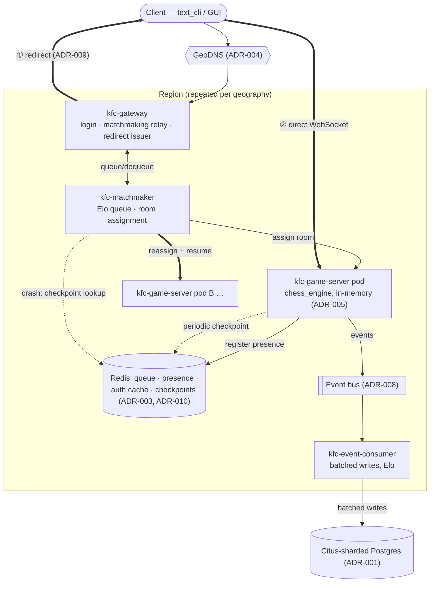

# Kong Fu Chess — Production System Design

**Status:** Approved design, ready for build-out
**Document type:** Software Architecture Document (SAD)

Target: take Kong Fu Chess from its current state — a single asyncio
process (`server/`), SQLite-backed, serving one WebSocket per client — to
a distributed, containerized platform serving real-time play at global
scale. `chess_engine/` and the local `app_gateways/` clients (text CLI,
GUI) are unchanged throughout; this document is entirely about how
`server/` is hosted and split.

## Table of contents

1. [Overview & Goals](#1-overview--goals)
2. [Glossary & Assumptions](#2-glossary--assumptions)
3. [Architecture Diagram](#3-architecture-diagram)
4. [System Components](#4-system-components)
5. [Data Layer & Storage Strategy](#5-data-layer--storage-strategy)
6. [Architecture Decision Records (ADRs)](#6-architecture-decision-records-adrs)
7. [Fault Tolerance & Resilience](#7-fault-tolerance--resilience)
8. [Observability & Monitoring](#8-observability--monitoring)
9. [Execution & Implementation Checklist](#9-execution--implementation-checklist)

---

## 1. Overview & Goals

**Business goals**
- Serve real-time competitive play at a scale no single process or single
  region can support.
- Preserve today's gameplay (continuous motion, cooldowns,
  reconnect-to-resume) without move-latency degradation as load grows.
- Survive routine operations (deploys, node loss, autoscaling) without
  players losing matches, beyond a small, explicitly bounded residual risk.
- Adopt sharding, event sourcing, and regional topology from day one
  rather than retrofitting them at the next order of magnitude.

**Target scale**

| Metric | Value |
|---|---|
| Registered users | 100,000,000 |
| Concurrent players (CCU) | 10,000,000 |
| Move cadence | ~1 move / player / 2s |
| Match duration | 30–90s (avg. ~60s) |
| Peak move throughput | ~5,000,000 moves/sec |
| Peak room churn | ~83,000 room creations/sec |

---

## 2. Glossary & Assumptions

| Term | Meaning |
|---|---|
| CCU | Concurrent users with an open session. |
| Room | One live match: two players, a `GameEngine`, its motions/cooldowns/history/score. |
| Checkpoint | Periodic snapshot of a room's state in Redis, used to resume after a crash. |
| Redirect | Signed, short-lived token + address handoff moving a client from `kfc-gateway` to the `kfc-game-server` pod hosting its room. |
| Fleet | An [Agones](https://agones.dev/) resource managing individually-addressable game-server pods, replacing a bare `Deployment`. |
| Presence registry | Redis mapping of `user_id`/`room_id` → owning pod address. |
| Graceful drain | A pod that stops accepting new rooms but finishes in-flight ones before exiting. |
| Citus | Postgres extension that shards tables across worker nodes behind one coordinator. |

**Assumptions:** every CCU sends ~1 move/2s, always relayed to an
opponent; no match exceeds 90s; `chess_engine/` stays fully unaware of
networking/hosting; regions share no synchronous write path; Postgres/
Citus and cloud Kubernetes control planes are managed services, not
built here.

---

## 3. Architecture Diagram

Two supporting sequence diagrams (normal match lifecycle, and crash
recovery) follow the same flow: login → matchmaking → redirect → direct
play → async durable write, and — only on an ungraceful pod death —
heartbeat loss → checkpoint lookup → reassignment → `MATCH_RESUMED`
redirect. See ADR-009 and ADR-010 (§6) for the message-level detail.

---

## 4. System Components

The monolith splits along its existing module boundaries into four
services plus one shared library (full rationale: ADR-002).

| Service | Absorbs | State | Scales on |
|---|---|---|---|
| `kfc-gateway` | `server/network/*` | Stateless | `websocket_open_connections` |
| `kfc-matchmaker` | `server/matchmaking/*`, `server/rooms/*` | Stateless (state in Redis) | `matchmaking_queue_depth` |
| `kfc-game-server` | `server/game/*` + `chess_engine/` (unchanged) | Stateful, in-memory | `in_flight_rooms` |
| `kfc-event-consumer` | `server/db/*`, `server/rating/*` | Stateless | `event_bus_consumer_lag` |
| `libs/kfc_common` | `server/auth/*`, `server/config.py` | shared lib, no service | — |

**Layout:** one `services/kfc-*/{Dockerfile, src, tests}` directory per
service; `chess_engine/` and `app_gateways/` stay exactly where they are.
`libs/kfc_common` adds `protocol.py` (binary wire frame, ADR-006),
`redirect_token.py` (ADR-009), and `checkpoint_schema.py` (ADR-010) as new
modules; everything else is a near-direct move of an existing `server/*`
module into its new service.

**Containers.** Every service uses the same multi-stage Dockerfile shape:
a `builder` stage installs deps into a venv, a slim `python:3.12-slim`
runtime stage copies the venv + code, runs as non-root, exposes `9090`
for health/metrics. `kfc-game-server` additionally exposes `7000` — a
public game port, since ADR-009 has clients connect to it directly after
a redirect instead of only via the gateway.

**Local dev.** `deploy/docker-compose.yml` runs Citus (coordinator + 2
workers), Redis, and all four services wired the same way production is
wired (same images, same env-driven config) — Citus locally too, so
sharding bugs surface on a laptop, not in production. Clients connect to
`kfc-gateway` for login/matchmaking, then follow the ADR-009 redirect to
`kfc-game-server` directly, exactly as in production.

**Production (Kubernetes).** `kfc-gateway`/`kfc-matchmaker`/
`kfc-event-consumer` are plain `Deployment` + `Service` + `HPA`.
`kfc-game-server` runs as an **Agones `Fleet`**, not a bare `Deployment`,
because ADR-009 requires routing a client to one *specific* pod — Agones
allocates each pod a `hostPort` and reports the address back for
`kfc-gateway`'s redirect issuer to hand to clients. All manifests live
under `deploy/k8s/base/`, templated per region via Kustomize overlays
(ADR-004).

---

## 5. Data Layer & Storage Strategy

**Database — Citus-sharded Postgres (ADR-001).** SQLite is replaced with
**Azure Cosmos DB for PostgreSQL** (managed Postgres + Citus): `users`
hash-distributed by `id`; a new `matches` table distributed by
`white_user_id`; a new `match_participants` table (one row per side)
distributed by `user_id` so "my match history" is always a single-shard
read. One coordinator + worker set per region. Migrations run via Alembic
plus Citus `create_distributed_table` calls (`kfc-migrations`).

**Coordination — Redis (ADR-003).** One cluster, four namespaced uses:
matchmaking queue (sorted set by Elo), presence registry (`user_id`/
`room_id` → pod address), auth/session cache, and match checkpoints +
recovery kill-switch (ADR-010). Sized at a few GB for 10M live presence
entries plus a low-single-digit-GB checkpoint footprint at 5M concurrent
rooms.

**Volume strategy** — a volume exists only where losing the data costs
more than persisting it:

| Component | Volume? |
|---|---|
| `kfc-gateway`, `kfc-matchmaker`, `kfc-event-consumer` | None (stateless) |
| `kfc-game-server` | None for match state — `emptyDir` scratch only; room state is memory-only and deliberately lost on crash (ADR-005) |
| Redis | Yes — `StatefulSet` + PVC per replica, AOF persistence |
| Postgres/Citus | Yes, but managed by the cloud provider, not a cluster PVC |
| Logs | None — shipped off-pod immediately (Fluent Bit, §8) |

**Async event sourcing (ADR-008).** `kfc-game-server` never writes moves
to Postgres synchronously (5M writes/sec is unsustainable). It publishes
`MoveAccepted`/`PieceCaptured`/`GameOver` onto a durable bus (Kafka or
Redis Streams); `kfc-event-consumer` batches and writes match results and
Elo deltas asynchronously — dropping the DB write rate to ~83k
results/sec, further reduced by batching. Match results are eventually
consistent (seconds of lag), not instantaneous.

---

## 6. Architecture Decision Records (ADRs)

Each entry is a final decision, not a survey — context, decision,
accepted trade-offs. Implementation lives in §4/§5/§7 as noted.

**ADR-001 — Reject SQLite; adopt Citus-sharded Postgres from day one.**
SQLite has one writer and no network protocol — unusable once more than
one server process exists. *Decision:* managed Postgres+Citus from the
first deployment (§5), avoiding a live resharding migration later.
*Cost:* an external managed dependency, Citus-aware migrations, and a
new discipline of always filtering on each table's distribution column.
*Benefit:* horizontal write scaling and failover from day one.

**ADR-002 — Decompose the monolith into four services.**
Connection count, matchmaking throughput, and simulation CPU scale on
different curves and shouldn't share a crash domain. *Decision:* split
along `server/`'s existing module boundaries into `kfc-gateway`,
`kfc-matchmaker`, `kfc-game-server`, `kfc-event-consumer` (§4); `auth`
becomes a shared library, not a fifth service. *Cost:* network calls
replace function calls; local dev now runs multiple processes. *Benefit:*
independent scaling and fault isolation per tier.

**ADR-003 — Redis as the presence registry and matchmaking queue.**
Once matchmaking and game hosting are different pods, "who is queued" and
"which pod holds room X" need a shared location. *Decision:* one Redis
cluster holds the queue, presence registry, auth cache, and (ADR-010)
checkpoints (§5). *Cost:* Redis becomes a hard dependency, not just a
cache — it gets persistence and failover, unlike stateless tiers.
*Benefit:* room/user resolution becomes a lookup, not a search.

**ADR-004 — Regionally-sharded Kubernetes/K3s clusters, no global cluster.**
5M moves/sec is ~4–12 Gbps depending on protocol — small for the
internet, large for one cluster's ingress; cross-ocean routing also hurts
latency. *Decision:* one cluster per major geography, GeoDNS routing,
same-region-first matchmaking, cross-region presence replication. *Cost:*
N clusters to operate instead of one. *Benefit:* traffic and blast radius
both shrink per region.

**ADR-005 — Live match state is in-memory only.**
At ~83k room creations/sec, per-match volumes or synchronous DB writes
are infeasible. *Decision:* a room is an in-memory task inside a
`kfc-game-server` pod — no PVC, no synchronous Postgres write; recoverable
best-effort via ADR-010's checkpoints, not guaranteed (§7.1). *Cost:* a
pod crash can still lose a match outright in edge cases. *Benefit:* zero
disk cost at room-churn scale.

**ADR-006 — Binary wire protocol over JSON.**
A JSON move frame is ~150 bytes on the wire; at 5M moves/sec that's
~12 Gbps total. *Decision:* a fixed-size binary frame for move traffic
(~4 Gbps, ~3x reduction); JSON stays for low-frequency messages. *Cost:*
less human-debuggable traffic, a version-negotiation step. *Benefit:*
cheapest available lever on the dominant traffic source.

**ADR-007 — Graceful draining, not eviction, for Game Server.**
A standard `SIGTERM`→`SIGKILL` cycle would abort every in-flight match on
a pod. *Decision:* `preStop` deregisters the pod from new-room assignment,
`terminationGracePeriodSeconds: 120` lets it wait out its rooms (max 90s
each), `PodDisruptionBudget` + `maxUnavailable: 0` protect capacity during
rollouts (§7.2). *Cost:* deploys take up to ~2 minutes per pod. *Benefit:*
zero-downtime deploys for the one tier where downtime means a lost game.

**ADR-008 — Event sourcing between Game Server and the database.**
5M synchronous DB writes/sec is unnecessary — only match *results* need
durability on a player-visible timescale. *Decision:* publish domain
events to a durable bus; a separate consumer batches writes (§5). *Cost:*
eventual consistency (seconds of lag). *Benefit:* DB write path scales
independently of move frequency.

**ADR-009 — Direct client-to-Game-Server redirect after matchmaking.**
Relaying every move through `kfc-gateway` adds a needless hop once a room
is assigned. *Decision:* `kfc-gateway` hands the client a signed,
short-lived token + the assigned pod's address; the client opens a new
WebSocket straight to `kfc-game-server`, which verifies the token itself.
Agones supplies the per-pod addressability this requires (§4). *Cost:*
`kfc-game-server` becomes internet-facing and must verify its own auth;
`kfc-gateway`'s traffic profile shifts to control-plane-only. *Benefit:*
removes a serialize/relay hop from every one of 5M moves/sec.

**ADR-010 — Checkpoint match state to Redis for crash & drain recovery.**
At this scale, "rare" pod crashes stop being rare in absolute terms.
*Decision:* `kfc-game-server` checkpoints each room to Redis every ~2s
(board, motions, cooldowns, history, score, `schema_version`); on a lost
heartbeat, `kfc-matchmaker` looks up the checkpoint, reassigns the room,
and both clients get a `MATCH_RESUMED` redirect (ADR-009's mechanism)
instead of `room_lost` — with schema versioning, bounded retries
(`MAX_RECOVERY_ATTEMPTS`), and a Redis kill-switch as hardening (§7.3).
*Cost:* up to one checkpoint interval of moves can still be lost; new
serialization surface area. *Benefit:* load-driven crashes and slow
rollouts become recoverable instead of guaranteed losses — deliberately
scoped as crash insurance, not a substitute for `MAX_ROOMS_PER_POD`
capacity limits or a drain-speed mechanism (§7.2).

---

## 7. Fault Tolerance & Resilience

### 7.1 In-memory state, accepted risk (ADR-005)
Rooms live only in a `kfc-game-server` pod's memory — never on a PVC,
never synchronously in Postgres. On crash, recovery is best-effort via
checkpoints (§7.3), not guaranteed: a checkpoint not yet written, Redis
unavailable, a bad deserialize, or exhausted retries all fall back to
re-queuing both players. This is a deliberate, bounded residual risk, not
an oversight — it's the only way 83k room-creations/sec stays affordable.

### 7.2 Graceful draining (ADR-007)
`kfc-game-server`'s `preStop` hook calls `/admin/drain/start` (removes the
pod from the matchmaker's capacity pool), then polls `/admin/rooms/count`
until it hits zero or the 110s soft deadline (within the 120s
`terminationGracePeriodSeconds`) — then exits. A `PodDisruptionBudget`
(`minAvailable: 90%`) and `maxUnavailable: 0` rolling-update strategy
ensure voluntary disruptions never outpace replacement capacity.
**Deliberately unchanged by checkpointing:** a draining pod still just
waits out its rooms; checkpoint/resume is crash insurance, not a
drain-acceleration mechanism.

### 7.3 Checkpoint and crash recovery (ADR-010)
Every ~2s (decoupled from move cadence), `kfc-game-server` writes each
room's full state to Redis with a `schema_version` and a TTL above the
90s worst-case match length; it deletes the checkpoint on `GameOver`. On
a lost presence heartbeat, `kfc-matchmaker` checks
`checkpoint_recovery_enabled` (kill switch) and `MAX_RECOVERY_ATTEMPTS`,
then looks up the checkpoint. Found + readable → reassign to a healthy
pod, rehydrate via `build_game_stack(checkpoint=...)`, redirect both
clients with `MATCH_RESUMED`. Missing, expired, or unreadable
(schema-version mismatch after an upgrade) → fall back to the original
`room_lost` re-queue path unchanged. New metrics
(`match_checkpoint_write_latency_seconds`, `match_checkpoint_age_seconds`,
`match_recoveries_total{outcome}`) make recovery behavior a dashboard,
not a claim (§8).

---

## 8. Observability & Monitoring

- **Metrics — Prometheus.** Scrapes every service's `9090` port;
  `prometheus-adapter` feeds the custom metrics each HPA scales on
  (`websocket_open_connections`, `matchmaking_queue_depth`,
  `in_flight_rooms`, `event_bus_consumer_lag`) plus the ADR-010 recovery
  metrics — installed before any HPA is applied (§9 Phase 4), since HPAs
  have nothing to read otherwise.
- **Dashboards — Grafana**, provisioned as code (JSON + `ConfigMap`, not
  clicked together): Fleet/Agones capacity, per-service HPA behavior, the
  ADR-010 recovery dashboard, and a drain dashboard showing
  `in_flight_rooms` trending to zero during rollouts.
- **Logs — Fluent Bit + Loki.** A `DaemonSet` ships stdout/stderr off-pod
  immediately (pod filesystems are ephemeral, and `kfc-game-server` pods
  are short-lived by design); structured JSON logging keeps logs queryable
  by `room_id`/`user_id`/`trace_id`, important for reconstructing a
  crash-recovery incident.
- **Load testing — k6 + Locust.** k6 drives protocol-level load against
  the binary wire format to validate the ADR-004/ADR-006 traffic
  projections and to background-load rolling-update drain tests; Locust
  drives Python-scripted end-to-end scenarios (login → match → redirect →
  reconnect) and chaos tests (pod kills, schema-version bumps), asserting
  on client-visible correctness, not just throughput. Both run as
  in-cluster Jobs against the same Prometheus/Grafana stack.

---

## 9. Execution & Implementation Checklist

**Phase 0 — Baseline.** Confirm the existing test suite is green; tag it
as the behavior-parity reference.

**Phase 1 — Extract libraries & services.** Move `server/config.py`/
`auth/*` into `libs/kfc_common`; split `server/*` into the four
`services/kfc-*` packages (§4); introduce the binary protocol (ADR-006)
behind a version flag; add event publishing (ADR-008); build the
redirect-token module and issuer/verifier (ADR-009); build the
checkpoint writer/restore path and the matchmaker's recovery coordinator
(ADR-010); unit-test each service in isolation, including a checkpoint
round-trip, a schema-mismatch fallback, and the kill switch.

**Phase 2 — Data layer migration (ADR-001).** Stand up Citus (dev tier);
write Alembic migrations for `users`/`matches`/`match_participants` with
`create_distributed_table`; verify shard placement; port repositories off
`sqlite3`, auditing every query for its distribution-column filter.

**Phase 3 — Containerize.** Build and boot each Dockerfile; bring up
`docker-compose.yml` and validate one full match end-to-end, including a
mid-match `kfc-game-server` kill that exercises checkpoint/resume; add
the compose stack as a CI integration stage.

**Phase 4 — Cluster provisioning.** Provision the first region
(Terraform); install Prometheus/Grafana, Fluent Bit/Loki,
`prometheus-adapter`, and Agones; apply the Redis `StatefulSet`; create
credential and redirect-token-signing secrets via the cluster's secret
manager.

**Phase 5 — Deploy services.** Apply `kfc-event-consumer`, then the
`kfc-game-server` Fleet (confirm Agones reports allocated addresses),
then `kfc-matchmaker`, then `kfc-gateway`; apply all HPAs/PDBs and confirm
custom metrics are populated.

**Phase 6 — Validate zero-downtime drain (ADR-007).** Run background load
via k6, trigger a rolling Fleet update, and confirm no pod is force-killed
mid-match and zero deploy-attributable `room_lost` events.

**Phase 7 — Load & chaos testing.** Load-test gateway/matchmaker to HPA
ceilings; kill `kfc-game-server` pods (`SIGKILL`) and confirm checkpoint
recovery resumes most rooms, with the kill switch verified to fall back
cleanly; bump `schema_version` mid-load and confirm graceful fallback to
re-queue; validate real traffic/bandwidth measurements against the
ADR-004/006/009 projections.

**Phase 8 — Repeat per region.** Re-run Phases 4–7 for each additional
region; configure GeoDNS; enable cross-region Redis presence replication.

**Phase 9 — Cutover.** Run new-platform traffic in shadow if a live
monolith exists; cut over region by region while monitoring dashboards;
decommission the monolith once all regions have confirmed parity.
